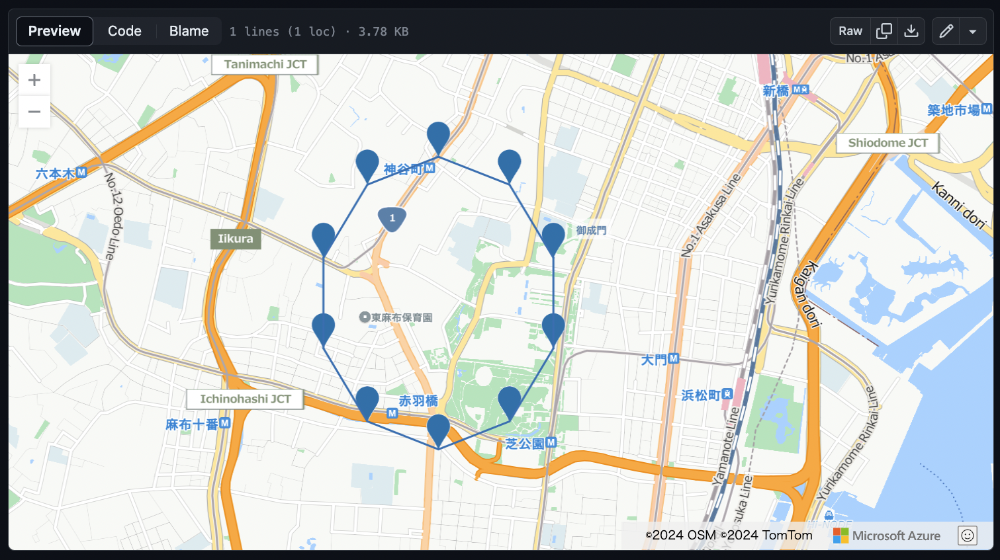
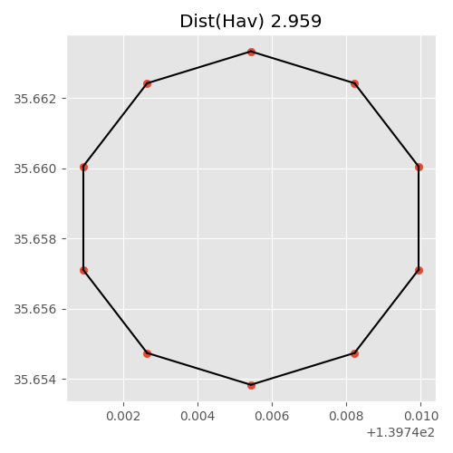
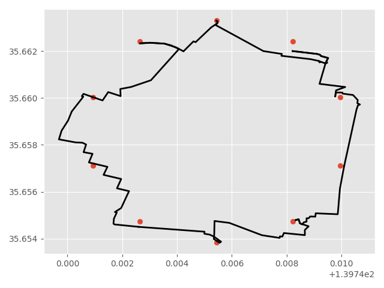

# Circular Routes

- 中心の周辺をジョギングできるようなルートを探したい

## 処理

### V2

- 経路の角を掃除する

### V1

- Zenn: https://zenn.dev/takilog/articles/575c58ed6b57de

- やったこと
  - 簡単実装: 中心点の周りに点を打ち、間の経路を探す
  - 間の経路はDirectionsAPI (e.g., Mapbox) で探す
    - API KEYは `./src/API_KEY.py` に置く (中身: `MAPBOX_API_KEY=XXXXXXX`)
- 円上の頂点をgithubの機能で可視化したもの

- Matplotlibでの可視化 (円上の点、経路)

| 円上の点 | 経路 |
| -- | -- |
|  |  |